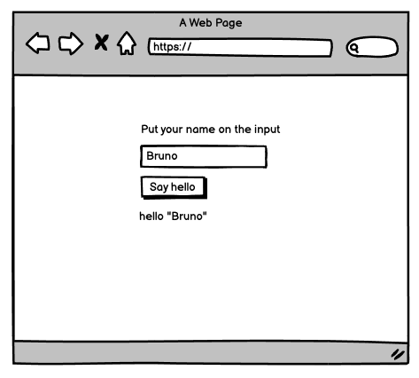

# Only Jest

Make the corresponding tests for the functions in lib/ExampleFunctions.js

# Make the test pass
 - Go to the file Text.test.js and paste the following test
```javascript
it('Should show a Header', () => {
    render(<Text />)
    const header = screen.getByRole('heading')

    expect(header).toBeInTheDocument()
})
```
Write the code needed to make this test pass.


# TDD Approach

Make a new component with a text title, an input and a button. When the user clicks the button a text should appear that says "Hello _name-on-the-input_" like shown in the image. Don't worry about styles for now.

Remember to *first* implement the test and then write the necessary code for it to pass.




